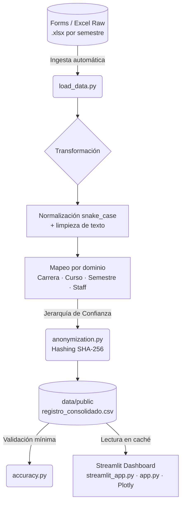

# Registro LEA
### Pipeline ETL y Analítica de Monitorías — Laboratorio de Economía Aplicada

[](https://www.python.org/)
[](https://pandas.pydata.org/)
[](https://streamlit.io/)
[]()


---

## Contexto y problema

El Laboratorio de Economía Aplicada (LEA) de la Javeriana Cali registra la asistencia y participación de estudiantes en sus monitorías a través de Microsoft Forms. Al exportar los datos, los archivos `.xlsx` presentan inconsistencias sistemáticas: errores ortográficos en nombres de carreras, variaciones tipográficas entre cursos, y duplicados de identidad generados por registros con correos distintos o nombres escritos de forma diferente.

Antes de este proyecto, la limpieza se hacía manualmente cada semestre. Este pipeline la automatiza por completo.

---

## Impacto

| Antes | Después |
|---|---|
| Limpieza manual de datos cada semestre | Pipeline automatizado: ejecutar `main.py` |
| PII expuesta en el dataset de análisis | 0% de PII — pseudonimización SHA-256 irreversible |
| Sin trazabilidad de errores | Log de auditoría con todos los valores huérfanos detectados |
| Sin visibilidad consolidada histórica | Dashboard interactivo con datos de todos los semestres unificados |


---

## Arquitectura del sistema



**Etapas del pipeline:**

1. **Ingesta automática (`load_data.py`)** — Escanea el directorio, extrae metadatos de año, concatena múltiples archivos `.xlsx` y estandariza cabeceras a `snake_case`.
2. **Transformación por dominio** — Normalización de texto (tildes, caracteres especiales, ruido estructural) y aplicación de diccionarios de homologación con complejidad O(1) para las variables *Carrera*, *Curso*, *Semestre* y *Staff*.
3. **Gobernanza y anonimización (`anonymization.py`)** — Implementa una *Jerarquía de Confianza* de 3 niveles para resolución de entidades únicas, seguida de pseudonimización irreversible con SHA-256 sobre toda la PII.
4. **Carga y auditoría** — Exportación del Data Mart consolidado. Los valores no mapeados se registran en `logs.log` sin detener la ejecución.

---

## Usuarios

| Usuario | Rol en el sistema |
|---|---|
| **Coordinador del LEA** | Consumidor del dashboard |
| **Monitores y Staff** | Fuente de datos — reporte de actividades vía Microsoft Forms |

---

## Estructura del repositorio

```text
registro_LEA/
├── data/
│   ├── raw/                    <- Excluido: archivos Excel con PII
│   └── public/                 <- Versionado: salida anonimizada para Streamlit Cloud
│       └── registro_consolidado.csv
├── src/
│   ├── ingestion/
│   │   └── load_data.py        <- Carga, concatenación y estandarización de cabeceras
│   ├── cleaning/
│   │   ├── anonymization.py    <- Jerarquía de Confianza + Hashing SHA-256
│   │   ├── clean_staff.py
│   │   ├── clean_carrera.py
│   │   ├── clean_semestre.py
│   │   ├── clean_curso.py
│   │   ├── clean_actividades.py
│   │   └── text_utils.py
│   ├── mappings/               <- Diccionarios de homologación por dominio
│   │   ├── staff.py            <- (excluido: .gitignore — contiene nombres reales)
│   │   ├── carrera.py
│   │   ├── curso.py
│   │   └── actividades.py
│   ├── pipeline/
│   │   ├── main.py             <- Orquestador principal del proceso ETL
│   │   └── accuracy.py         <- Validaciones mínimas del output final
│   └── analysis/
│       └── app.py              <- Aplicación Streamlit + Plotly Express
├── logs.log                    <- Excluido: auditoría local de valores huérfanos
├── streamlit_app.py            <- Entrypoint recomendado para Streamlit Community Cloud
├── requirements.txt
└── README.md
```

> **Nota:** Los archivos en `data/raw/` y `mappings/staff.py` no se versionan por privacidad. El dashboard desplegado usa `data/public/registro_consolidado.csv`, que se genera anonimizado desde el pipeline.

---

## Esquema de datos

### Input — Archivo crudo de registro (`.xlsx`)

Registros originales de asistencia exportados desde Microsoft Forms. Estado: crudo (raw), sin estandarizar.

| Columna | Tipo | Descripción |
| :--- | :--- | :--- |
| `No.` | INTEGER | Número de fila en el archivo de origen. |
| `Fecha` | STRING | Mes de la actividad (ej. "Febrero"). |
| `Nombres y apellidos` | STRING | Nombre completo del estudiante. Usado en la Jerarquía de Confianza como fallback. |
| `Carrera` | STRING | Programa académico. Requiere normalización — presenta errores tipográficos frecuentes. |
| `Semestre` | INTEGER | Nivel académico del estudiante (ej. 3, 5, 6). |
| `Monitor encargado (si aplica)` | STRING | Monitor que acompañó la sesión. |
| `Profesor Encargado (si aplica)` | STRING | Profesor titular o responsable del área. |
| `Curso` | STRING | Asignatura en la que se enmarca la sesión. |
| `Actividad (...)` | STRING | Tema específico de la sesión (ej. "Capacitación R", "Simulador"). |
| `Correo Institucional` | STRING | Email del estudiante. Fuente primaria de identidad en la Jerarquía de Confianza. |

### Output — `data/public/registro_consolidado.csv`

- **0% de PII** — nombres y correos eliminados post-hashing
- Variables categóricas estandarizadas y legibles
- Identificadores únicos trazables mediante SHA-256
- Salida versionable para Streamlit Community Cloud

---

## Gobernanza y privacidad de datos

El módulo `anonymization.py` implementa una **Jerarquía de Confianza de 3 niveles** para resolver la identidad única de cada estudiante antes del hashing:

1. **Email institucional** — máxima confianza (dominio universitario verificable)
2. **Email personal** — confianza media
3. **Nombre completo** — fallback de último recurso (mayor riesgo de variaciones tipográficas)

Una vez resuelta la identidad, se aplica **SHA-256** para generar un identificador alfanumérico irreversible. El dataset final no contiene ningún campo de PII.

---

## Stack tecnológico

| Capa | Tecnología |
|---|---|
| Lenguaje core | Python 3.10+ |
| Procesamiento de datos | Pandas 2.0+ |
| Seguridad y hashing | Hashlib (librería estándar de Python) |
| Dashboard e interfaz | Streamlit + Plotly Express |
| Control de versiones | Git / GitHub |

---

## Instrucciones de ejecución

### Prerrequisitos

- Python 3.10 o superior
- Archivos `.xlsx` por semestre ubicados en `data/raw/`
- `mappings/staff.py` con el diccionario de normalización del staff (no versionado)

### Paso 1 — Pipeline ETL

```bash
# Clonar el repositorio
git clone https://github.com/JuanEstiven-Data/registro_LEA.git
cd registro_LEA

# Crear y activar entorno virtual
python -m venv .venv
# source .venv/bin/activate      # Mac / Linux
# .venv\Scripts\activate         # Windows

# Instalar dependencias
pip install -r requirements.txt

# Ejecutar el orquestador
python src/pipeline/main.py
```

Output generado: `data/public/registro_consolidado.csv`

> Revisar `logs.log` para auditar valores huérfanos detectados durante el mapeo. Los valores no mapeados no detienen la ejecución — se registran para actualización manual de los diccionarios.

### Paso 2 — Validación mínima

```bash
python src/pipeline/accuracy.py
```

Este comando ejecuta el pipeline y valida esquema, privacidad, fechas, ciclos y preparación básica para análisis cruzado.

### Paso 3 — Dashboard

```bash
streamlit run streamlit_app.py
```

La aplicación se abre en `http://localhost:8501`. También puede ejecutarse directamente con `streamlit run src/analysis/app.py`.

### Paso 4 — Streamlit Community Cloud

En Streamlit Community Cloud, usar:

- Repository: `JuanEstiven-Data/registro_LEA`
- Branch: `main`
- Main file path: `streamlit_app.py`
- Python dependencies: `requirements.txt`

El despliegue no necesita `data/raw/` ni `mappings/staff.py`; solo consume el CSV público anonimizado.

---

## Alcance

**Dentro del alcance:**
- Procesamiento local de archivos `.xlsx` exportados manualmente desde Microsoft Forms
- Generación de un Data Mart unificado en `.csv` (sin límite de filas, agnóstico de plataforma)
- Pseudonimización completa: 0% de PII en el dataset final
- Dashboard interactivo con filtros dinámicos y gráficos por semestre, carrera, curso y actividad
- Despliegue del dashboard en Streamlit Community Cloud usando el dataset público anonimizado

**Fuera del alcance:**
- Conexión automatizada vía API a Microsoft Forms o Microsoft Graph
- Modificación del formulario original de recolección

---

## Supuestos y limitaciones

| Riesgo | Impacto | Mitigación |
|---|---|---|
| Cambio en el nombre de columnas del formulario entre semestres | Alto | Estandarización a `snake_case` + excepciones `try/except` con mensaje de error descriptivo |
| Nuevos programas académicos o cursos no mapeados | Medio | El pipeline no se detiene — registra los valores huérfanos en `logs.log` para actualización manual |
| Estudiante con correos distintos y variaciones extremas del nombre | Bajo | La Jerarquía de Confianza prioriza el email institucional; casos extremos pueden generar IDs duplicados (falsos negativos) |

**Supuestos base:**
- Las columnas obligatorias del formulario no cambian de nombre entre semestres
- Los archivos `.xlsx` se ubican en `data/raw/` con el formato esperado antes de ejecutar

---

## Mejoras futuras

- [x] Despliegue preparado para Streamlit Community Cloud con `streamlit_app.py` y `data/public/`
- [ ] Integración con la API de Microsoft Graph para eliminar la descarga manual de Excel
- [x] Validaciones mínimas del pipeline con `src/pipeline/accuracy.py`
- [ ] Pruebas unitarias con `pytest` para funciones críticas de limpieza

---

## Autor

**Juan E. Silva** — Analista BI · Monitor de Investigación LEA · Pontificia Universidad Javeriana  
[LinkedIn](https://linkedin.com/in/juanestiven-data) · [GitHub](https://github.com/JuanEstiven-Data)

---

*Proyecto desarrollado para el Laboratorio de Economía Aplicada (LEA) — Pontificia Universidad Javeriana, Cali. Uso interno institucional.*

